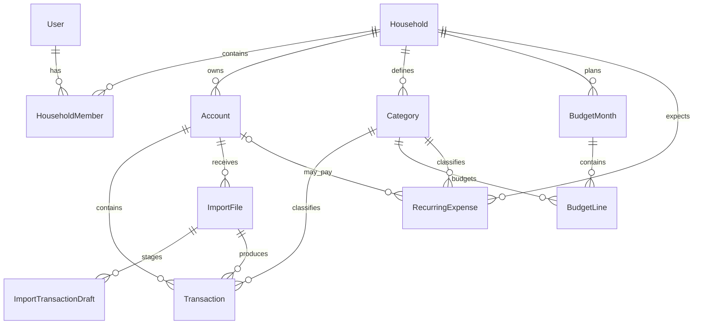

# Core Data Model

## Purpose

This document defines the initial domain model for BudgetApp. It is a planning reference, not a final database schema. Field names and persistence details may change during implementation, but the relationships, ownership rules, and invariants below should remain stable unless a later design decision explicitly replaces them.

BudgetApp supports personal and shared household finances. The model must keep those scopes explicit, preserve imported financial data, and prevent calculated features such as forecasting from becoming authoritative financial records.

## Model Overview



## Scope and Ownership

BudgetApp uses two financial scopes:

- **Household:** shared financial data owned by a household.
- **Personal:** financial data owned by one user within a household.

An `Account` declares its scope. Transaction scope normally derives from its account. A `BudgetMonth` declares its own scope because a household and each household member may have separate budgets for the same month.

For version 1, categories belong to the household and are reused across personal and household data. This avoids separate copies such as “Clayton Groceries,” “Partner Groceries,” and “Household Groceries.” Account, transaction, and budget scope determine how category totals are interpreted.

### BudgetMonth uniqueness

A budget month is unique by:

```text
HouseholdId + Year + Month + Scope + OwnerUserId
```

Additional rules:

- Household scope requires `OwnerUserId` to be empty.
- Personal scope requires `OwnerUserId` to identify an active member of the household.
- Only one matching budget month may exist, regardless of its lifecycle status.

### Pragmatic household references

`Transaction` and `ImportFile` include `HouseholdId` even though it can be reached through `Account`. This supports simpler permission checks, query filters, and indexing.

The application must enforce:

```text
record.HouseholdId == record.Account.HouseholdId
```

This denormalization must never allow a transaction or import to be associated with an account from another household.

## Core Entities

The fields below are conceptual. Common persistence fields such as IDs, creation timestamps, update timestamps, and concurrency tokens are implied where appropriate.

### User

Represents an authenticated person. The implementation will build on ASP.NET Core Identity rather than introducing a separate authentication system.

Key data:

- Identity user ID
- Display name
- Email and authentication data managed by Identity
- Locale, time zone, and other preferences as needed later

Rules:

- A user accesses household data through an active `HouseholdMember` record.
- Membership and financial ownership must reference the same Identity user ID.
- Supporting multiple household memberships is structurally possible, even if the first UI assumes one active household.

### Household

The shared boundary for members, accounts, categories, budgets, imports, and recurring expenses.

Key data:

- Name
- Default currency
- Time zone
- Active status

Rules:

- Household-owned records cannot be moved between households through ordinary editing.
- Currency conversion is outside the initial scope; a household has one default currency for version 1.

### HouseholdMember

Represents a user's membership in a household and is more than a simple join table.

Key data:

- Household ID
- User ID
- Role: Owner, Admin, Editor, or Viewer
- Membership status, such as Invited, Active, or Disabled
- Joined date
- Invited-by user, when applicable

Rules:

- A user can have only one membership record per household.
- Every household must retain at least one active Owner.
- A disabled or pending member cannot access household financial data.
- Household roles govern shared data; they do not automatically grant access to another member's personal data.

### Account

Represents the source or destination of transactions, such as chequing, savings, credit card, cash, or another account type.

Key data:

- Household ID
- Name
- Account type
- Scope: Household or Personal
- Owner user ID, required for Personal scope and empty for Household scope
- Institution name, optional
- Currency
- Active or archived status
- Optional non-sensitive account identifier such as the last four digits

Rules:

- A personal account owner must be an active member of the household.
- Archived accounts retain their transactions and history.
- Credentials, full bank account numbers, and banking passwords are never stored.
- Current balance should not be treated as authoritative until balance snapshots or reconciliation are implemented.

### Category

Defines a household's shared classification vocabulary.

Key data:

- Household ID
- Name
- Type: Income, Expense, or Transfer
- Optional parent category ID
- Display order
- Active status
- Default/system indicator, if seeded categories need protection from deletion

Rules:

- Parent and child categories must belong to the same household.
- Circular category hierarchies are invalid.
- An inactive category remains attached to historical records but cannot be selected for new work.
- Personal-only categories are deferred until there is a demonstrated need.

### Transaction

An official financial record that has been manually entered, approved from an import, or created explicitly as an adjustment.

Key data:

- Household ID
- Account ID
- Category ID, optional while uncategorized
- Import file ID, optional
- Import row reference, optional
- Transaction date
- Posted date, optional
- Amount
- Description
- Original imported description, optional
- Merchant/display name, optional
- Source: Manual, Import, or Adjustment
- Review status
- Excluded-from-budget flag
- Notes
- Last modified by user and modification timestamp

Rules:

- Household ID must match the account's household.
- Imported transactions are created only from approved draft rows.
- Corrections must not erase the original imported values.
- A discrepancy should normally be represented by an explicit adjustment transaction rather than an unexplained edit to another transaction.
- Transfers, reimbursements, and transaction splits may need richer models later. Version 1 may begin with category type and exclusion flags.

The amount sign convention must be selected before entity implementation and applied consistently to imports, budgeting calculations, and reporting.

### ImportFile

Tracks one uploaded bank file and the account into which its rows may be imported.

Key data:

- Household ID
- Account ID
- Uploaded-by user ID
- Original filename
- File hash
- Upload timestamp
- Import status
- Detected or selected import profile, optional
- Row counts: total, valid, invalid, approved, rejected, and duplicate
- Failure summary, optional

Rules:

- Household ID must match the selected account's household.
- The uploader must have permission to import into the selected account.
- A stable file hash helps identify accidental repeat uploads.
- File retention and deletion policy must be decided before production use. Parsed source values must remain traceable even if the original file is deleted.

### ImportTransactionDraft

Represents one staged row from an uploaded file before it becomes an official transaction.

Key data:

- Import file ID
- Source row number
- Raw source values or a safe serialized representation
- Parsed date, amount, and description
- Suggested category ID, optional
- User-selected category ID, optional
- Validation status and messages
- Duplicate detection result and possible matching transaction ID
- Review decision: Pending, Approved, Rejected, or Skipped
- Approved transaction ID, optional

Rules:

- Raw and originally parsed values remain unchanged when a reviewer corrects mapped values.
- Invalid rows cannot be approved until corrected.
- Approval must be idempotent; retrying it cannot create a second transaction.
- Rejecting or skipping a draft does not delete its import history.

### BudgetMonth

The monthly container for one household or personal budget.

Key data:

- Household ID
- Year and month
- Scope: Household or Personal
- Owner user ID, required only for Personal scope
- Status: Draft, Active, or Closed
- Optional notes

Rules:

- The scope and uniqueness rules defined earlier apply.
- Closing a budget preserves it for reporting; it does not delete or rewrite transactions.
- Actual spending is calculated from eligible transactions rather than stored as an authoritative field.

### BudgetLine

Stores the planned amount for one category within a budget month.

Key data:

- Budget month ID
- Category ID
- Budgeted amount
- Optional note
- Optional origin marker, such as Manual, Copied, or RecurringExpense

Rules:

- A category may appear only once in a budget month.
- The category and budget month must belong to the same household.
- Actual and remaining amounts are calculated values.
- Copying a prior month creates independent lines; later edits do not modify the source month.

### RecurringExpense

Describes a predictable expense or income expectation. Despite the initial name, the model should be capable of representing regular income as well as expenses.

Key data:

- Household ID
- Name
- Scope: Household or Personal
- Owner user ID, required only for Personal scope
- Category ID
- Account ID, optional
- Expected amount
- Frequency or recurrence pattern
- Expected day or due-date rule
- Start and optional end date
- Active status
- Optional notes

Rules:

- Category and optional account must belong to the same household.
- Personal scope requires an active household member as owner.
- A recurring expense may suggest or generate budget lines and forecast occurrences.
- It never silently creates an official transaction.
- Editing a recurrence affects future expectations without rewriting historical budgets or transactions.

## Calculated Features

### Forecasting

Forecasting is an application query/service, not a stored core entity in version 1. It can combine:

- Current approved transactions
- Budget lines
- Active recurring expenses and income
- Account balances or future balance snapshots
- Explicit temporary forecast assumptions

Forecast output is read-only and disposable. Every value should be explainable as actual, scheduled, budgeted, or manually assumed. Once a real transaction is matched to an expected recurring occurrence, the forecast must avoid counting both.

## Deferred Supporting Models

These concepts are expected but are not required in the first database version.

### AccountBalanceSnapshot

Supports reconciliation and balance-based forecasting.

Suggested data:

- Account ID
- Balance date and time
- Balance amount
- Source: Manual, Import, or System
- Recorded-by user ID, optional
- Note or source reference, optional

Snapshots are observations, not transactions. They help identify missing or incorrect transactions but do not silently change transaction history.

### Other deferred concepts

- CategorizationRule
- MerchantAlias
- ImportProfile and saved column mappings
- AuditEntry or richer change history
- TransactionSplit
- Explicit transfer linkage
- Reimbursement tracking
- Recurring occurrence/matching history

AI suggestions will be introduced behind backend interfaces only. They may propose categories, column mappings, merchant aliases, or explanations, but they must never change financial records without user confirmation.

## Security and Query Invariants

- Every household query requires active household membership.
- Personal accounts and personal budgets are visible only according to an explicit privacy policy; a household role alone must not imply access.
- Write operations validate both household membership and role/ownership.
- Household IDs supplied by the client are never trusted without verifying related records.
- API controllers stay thin; authorization and business invariants belong in application use cases and domain rules.
- Infrastructure owns EF Core, SQL Server, Identity, file persistence, and future external providers.

## Decisions Required Before Implementation

- Transaction amount sign convention
- Initial personal-data visibility policy between household members
- File size limits and uploaded-file retention policy
- Whether version 1 permits manual transaction entry
- Whether regular income uses `RecurringExpense` initially or a more general UI label such as “Recurring Items”
- Minimum role permissions for accounts, imports, categories, budgets, and household administration
